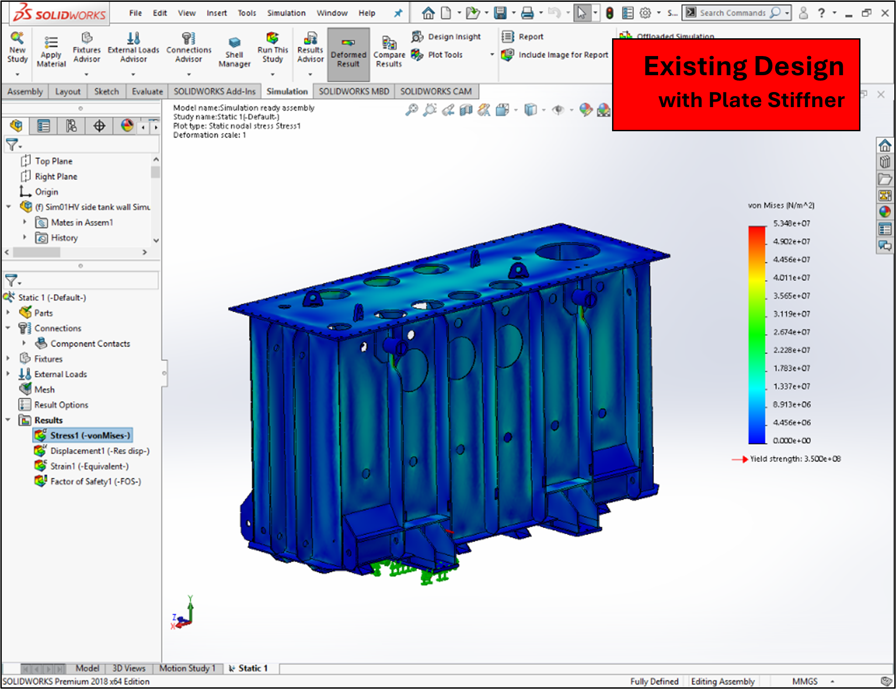
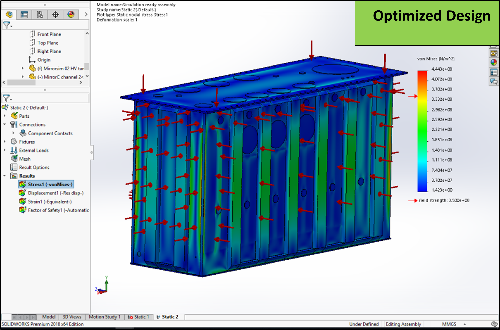
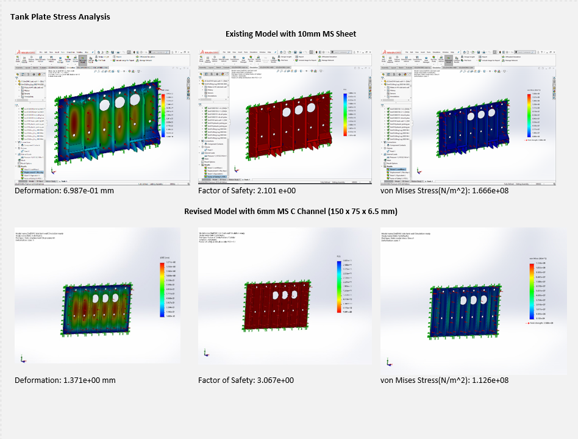

# Structural Optimization of Transformer Tanks
**Tools:** SolidWorks · FEA · Sheet Metal · GD&T

[← Back to Portfolio](./index.md)

---

## Overview
Optimized the structural design of heavy-duty transformer tanks to minimize material usage and weight while maintaining full structural integrity under all mandatory loading conditions. Replaced traditional plate stiffeners with C-channel stiffeners, achieving significant weight reduction without compromising the factor of safety.

## Objectives
- Minimize transformer tank weight while maintaining structural safety under all loading conditions
- Validate optimized design against mandatory loading cases using FEA simulation
- Develop a replicable optimization methodology applicable to other product lines

## My Contribution
- Led the full structural redesign from concept through simulation validation
- Built 3D models of both existing and optimized designs in SolidWorks
- Performed static FEA analysis using SolidWorks Simulation to evaluate von Mises stress, deformation, and factor of safety
- Proposed and validated the switch from flat plate stiffeners to C-channel stiffeners

**Existing Design with Plate Stiffener**

**Optimized Design with C-Channel Stiffener**

## Key Results
- Weight reduction from HV plate: 124 kg
- Weight reduction from ribs: 144 kg
- Total weight reduction: ~268 kg per tank
- Factor of Safety improved from 2.10 to 3.07 — a ~46% increase
- Von Mises stress reduced from 1.67×10⁸ N/m² to 1.13×10⁸ N/m²

**Stress Analysis Results**

## Tools & Methods
SolidWorks (3D modeling & assembly) | SolidWorks Simulation (Static FEA) | C-Channel stiffener topology | Factor of Safety analysis | GD&T
