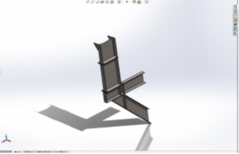
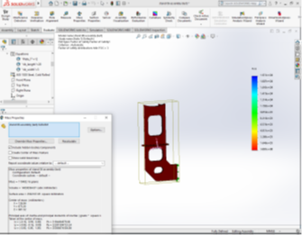
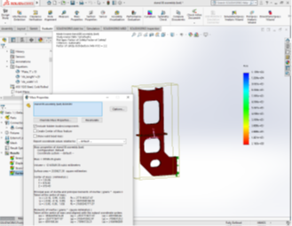

# Conservator Stand Redesign — 120 MVA Power Transformer

**Tools:** SolidWorks · Topology Optimization · Structural Analysis · FEA · DFM

[← Back to Portfolio](./index.md)

---

## Overview

Redesigned the conservator stand of a 120 MVA power transformer using topology optimization to minimize material usage while maintaining structural integrity. The project reduced stand weight from 196 kg to approximately 96–110 kg depending on plate thickness, while achieving an acceptable factor of safety for all load cases.

---

## Objectives

- Minimize material usage in the conservator stand through topology-driven redesign
- Maintain structural safety under operational loading conditions
- Evaluate trade-off between weight reduction and factor of safety across plate thickness options

---

## My Contribution

- Performed topology optimization analysis in SolidWorks Simulation to identify non-critical material regions for removal
- Developed two optimized design variants (10 mm and 12 mm plate thickness) and evaluated each against the original 196 kg baseline
- Conducted FEA stress and safety analysis for both variants to determine optimal plate thickness recommendation
- Produced detailed engineering drawings for the recommended design for manufacturing release

---

## Key Results

| Design Variant | Weight | Reduction | Factor of Safety | Recommendation |
|---|---|---|---|---|
| Original — AISI 1020 Cold Rolled Steel | 196 kg | — | Baseline | — |
| Optimized — 12 mm plate | 110 kg | 44% | Adequate | ✅ Recommended |
| Optimized — 10 mm plate | ~96 kg | 51% | 2.18 | Further weight saving if FoS acceptable |

### CAD Models

| Existing Design (196 kg) | Optimized Design (110 kg — 12 mm plate) |
|:---:|:---:|
|  |  |

### FEA Simulation Results

| Existing Design — FoS Baseline | Optimized Design — 10 mm plate, FoS = 2.18 |
|:---:|:---:|
|  |  |

---

## Tools & Methods

SolidWorks (3D modeling) | SolidWorks Simulation (Topology Optimization & FEA) | AISI 1020 Cold Rolled Steel | Principal stress and moment of inertia analysis
