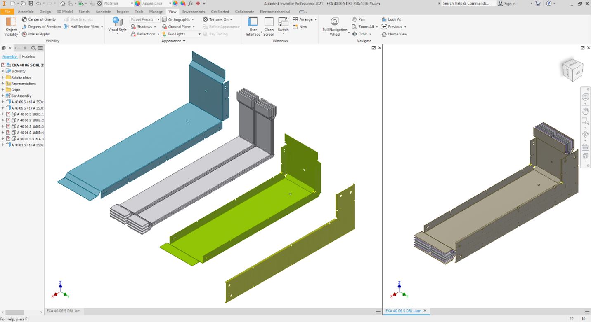
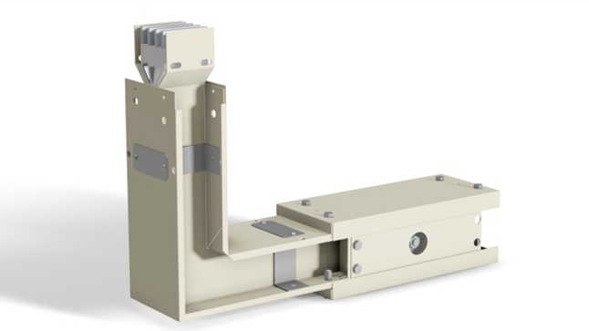

# BUSBAR Trunking System — Ingress Protection IP65

**Tools:** Autodesk Inventor · Sheet Metal · CNC · CAM · IP65 · AMADA

[← Back to Portfolio](./index.md)

---

## Overview

Designed and fabricated a BUSBAR trunking system meeting IP65 ingress protection requirements — dust-tight and protected against water jets from any direction. The project was conducted in collaboration with Energypac Europe (Research Consultant: Alessandro Gallo) and involved full design-to-fabrication execution using CNC sheet metal processing.

---

## Objectives

- Design a BUSBAR trunking enclosure meeting IP65 protection standard
- Ensure dust-tight sealing and protection against water projected from any direction (6.3 mm nozzle)
- Design for CNC fabrication using 1.2 mm Pre-painted Galvanized Sheet (PPGS) metal

---

## My Contribution

- Implemented the enclosure design in Autodesk Inventor with appropriate clearances for IP65 gasket and insulator assembly
- Operated AMADA HM1003 CNC machine for cutting, punching, and bending PPGS sheet metal to design specifications
- Cut and bent internal aluminum/copper conductors and applied electric insulating paper wrapping
- Assembled complete trunking units with insulators and gaskets to achieve IP65 certification compliance
- Contributed to insulation improvement and conducted testing to verify IP65 performance

---

## Key Results

- Successfully achieved IP65 ingress protection rating — dust-tight and water jet resistant
- Design validated through physical testing per IP65 standard requirements
- Full fabrication executed in-house using CNC equipment with no outsourced tooling

## Product Design

| Exploded Assembly View & Assembled CAD Model | Final Product|
|:---:|:---:|
|  |  |

---

## Tools & Methods

Autodesk Inventor (3D modeling & assembly) | Exploded view drawings | DFM for injection molding | Prototype testing | BOM and manufacturing documentation
