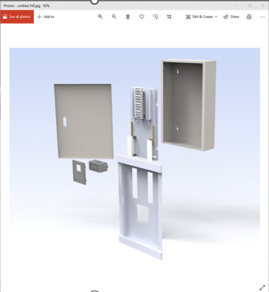

# Metal Power Distribution Box — 160A MCB Board (8-Way)

**Tools:** SolidWorks · Sheet Metal Design · Autodesk Inventor · DFM · Manufacturing Lead

[← Back to Portfolio](./index.md)

---

## Overview

Designed and manufactured a compact sheet metal enclosure for a TP+N busbar type, 160A MCB electrical distribution board (8-way). The project covered complete product design through physical manufacturing, including sheet metal forming, assembly, and final product validation.

---

## Objectives

- Design a compact sheet metal enclosure for a 160A MCB distribution board, 8-way TP+N busbar configuration
- Ensure enclosure meets dimensional, structural, and electrical safety requirements
- Lead manufacturing team through fabrication and assembly to produce final product

---

## My Contribution

- Led complete product design in Autodesk Inventor — enclosure body, door, cable entry provisions, and internal busbar mounting geometry
- Applied sheet metal design principles — bend allowances, k-factor, flange design, and fabrication-appropriate tolerancing
- Produced 2D manufacturing drawings with full GD&T annotations for production release
- Served as Manufacturing Team Lead — oversaw cutting, punching, bending, and assembly operations through to finished product
- Verified final product against design specifications and electrical clearance requirements

---

## Key Results

- Successfully designed and manufactured a production-ready 160A MCB distribution board enclosure
- Final product met all dimensional and functional requirements — verified against design and electrical standards
- Design and manufacturing documentation released for repeat production

---

## Product Design

| CAD Model | Exploded View | Final Product |
|:---:|:---:|:---:|
|  |  |  |

---

## Tools & Methods

Autodesk Inventor (3D modeling) | SolidWorks (design verification) | Sheet metal fabrication (cutting, punching, bending) | GD&T engineering drawings | BOM and manufacturing documentation
